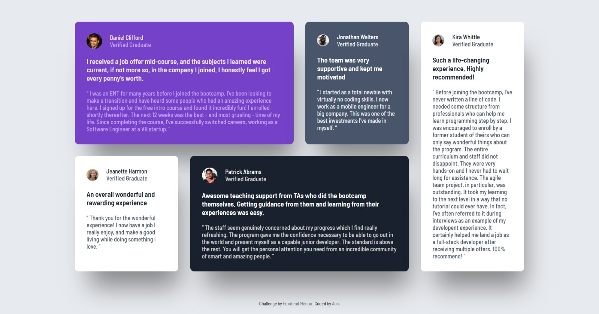

# Frontend Mentor - Testimonials grid section solution

This is a solution to the [Testimonials grid section challenge on Frontend Mentor](https://www.frontendmentor.io/challenges/testimonials-grid-section-Nnw6J7Un7). Frontend Mentor challenges help you improve your coding skills by building realistic projects. 

## Table of contents

- [Frontend Mentor - Testimonials grid section solution](#frontend-mentor---testimonials-grid-section-solution)
  - [Table of contents](#table-of-contents)
  - [Overview](#overview)
    - [The challenge](#the-challenge)
    - [Screenshot](#screenshot)
    - [Links](#links)
  - [My process](#my-process)
    - [Built with](#built-with)
  - [Author](#author)

## Overview

### The challenge

Users should be able to:

- View the optimal layout for the site depending on their device's screen size

### Screenshot

  <figure style="margin: 0; height: 100%; text-align: center;">
    <figcaption>Mobile preview</figcaption>
    

  </figure>
  <figure style="margin: 0; width: 80%; text-align: center;">
    <figcaption>Desktop preview</figcaption>
    
  </figure>

### Links

- [Live Site URL](https://theekaguru.github.io/Testimonials-Grid-Section-Main/)

## My process

### Built with

- Semantic HTML5 markup
- CSS custom properties
- Flexbox
- CSS Grid
- Mobile-first workflow
- Google Fonts

## Author

- Github- [@theekaguru](https://github.com/theekaguru/Testimonial-Grid)
